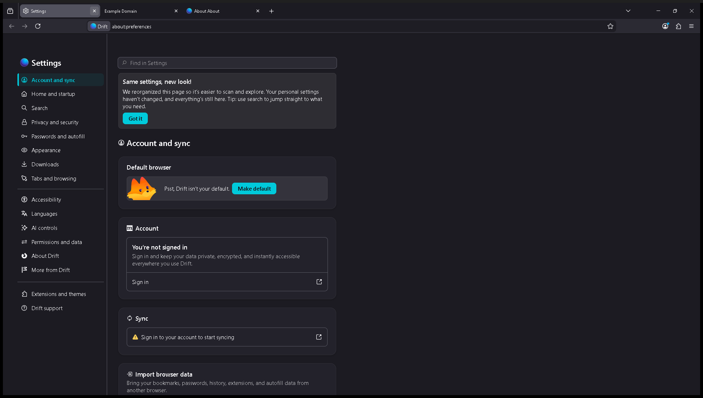
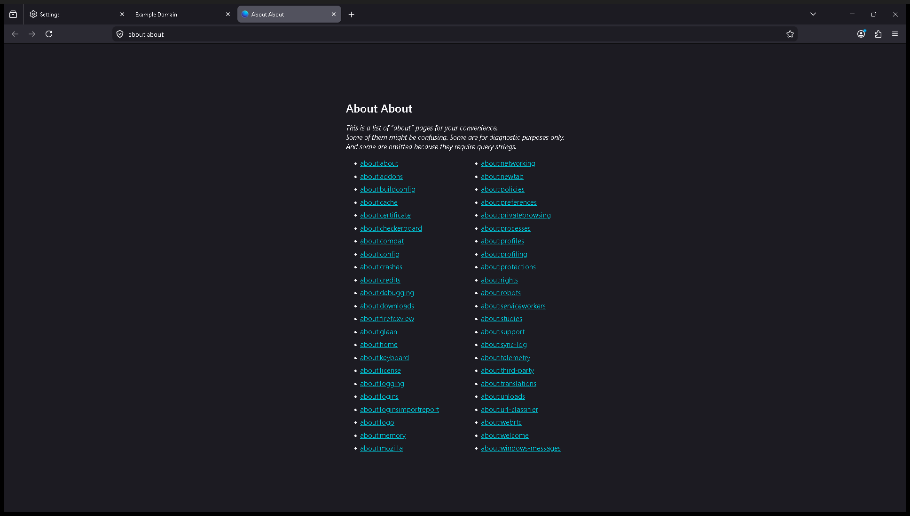

# Drift Browser

Drift is a custom Firefox-based browser built with [surfer](https://github.com/zen-browser/surfer), based on **Firefox 152.0.2**.

## Screenshots

| | |
|---|---|
|  |  |
| *New Tab page with search and shortcuts* | *Settings — Account, sync, and Drift-specific options* |
|  |  |
| *Browsing the web (example.com)* | *about:about — full list of internal pages* |

## Platform

**Windows 64-bit** (x86_64)

## Downloads

Installer and portable ZIP are available under [Releases](../../releases).

| File | Description |
|------|-------------|
| `drift-1.0.0.en-US.win64.installer.exe` | Windows installer (~82 MB) |
| `drift-1.0.0.en-US.win64.zip` | Portable ZIP (~123 MB) |

## Installation

1. Download the installer from the [latest release](../../releases/latest).
2. Run the installer and follow the prompts.
3. Launch **Drift** from the Start Menu or desktop shortcut.

---

## Building / editing on a new machine

This repository contains the Drift project config files only. The multi-GB Firefox
source tree is **not included** — it is downloaded automatically by surfer.

### Prerequisites (Windows)

- [Node.js](https://nodejs.org/) 18+ and npm
- [Mozilla Build](https://ftp.mozilla.org/pub/mozilla/libraries/win32/MozillaBuildSetup-Latest.exe) (provides MSYS/make/autoconf in `C:\mozilla-build`)
- [Rust (stable, MSVC ABI)](https://rustup.rs/) — `rustup toolchain install stable-x86_64-pc-windows-msvc`
- [Visual Studio 2022](https://visualstudio.microsoft.com/) with the "Desktop development with C++" workload (MSVC + Windows SDK)
- Python 3.12

### Quick start

```bash
# 1. Clone this repo
git clone https://github.com/ArthurMoorgan/drift-browser.git
cd drift-browser

# 2. Install surfer
npm install

# 3. Download Firefox 152.0.2 source into engine/
npx surfer download

# 4. Import Drift branding and apply surfer overlays
npx surfer import

# 5. Apply the Windows build-fix patches
cd engine
git apply ../patches/drift-engine-changes.patch
cd ..

# 6. Build
npx surfer build

# (or, if you prefer to invoke mach directly)
# bash do-build.sh
```

The first build takes 30–90 minutes depending on hardware. Subsequent incremental
builds are much faster.

### Project layout

```
surfer.json          # Drift identity, version, brand colours, addons
package.json         # npm deps (surfer)
configs/             # Per-platform mozconfig overrides
  common/mozconfig
  windows/mozconfig  # MSVC target, enables js-shell / rust-simd / crashreporter
  linux/mozconfig
  macos/mozconfig
locales/             # Supported locale list
patches/             # Unified-diff patches applied to the Firefox source after download
  drift-engine-changes.patch
src/                 # surfer source overlay (files here mirror the engine/ tree and
                     # are applied on top of Firefox source during `npx surfer import`)
do-build.sh          # Convenience wrapper: sets PATH/env then runs mach build (Windows/MSYS)
do-configure.sh      # Same for mach configure
```

### What the patch covers (`patches/drift-engine-changes.patch`)

The patch must be applied with `git apply` (or `patch -p1`) from inside `engine/` after
`npx surfer import`. It contains:

| File | Change |
|------|--------|
| `browser/config/version.txt` | Version string → `1.0.0` |
| `browser/config/version_display.txt` | Display version → `1.0.0` |
| `browser/moz.configure` | Vendor → `Drift`, profile dir → `drift` |
| `build/moz.configure/toolchain.configure` | Clang MinGW triple fix (Windows builds) |
| `build/moz.configure/windows-toolchain.configure` | MSVC / MinGW header path selection |
| `dom/crypto/CryptoBuffer.h` | Use `BufferSourceBinding.h` (forward-decl was insufficient) |
| `python/mozbuild/mozbuild/backend/recursivemake.py` | **Windows MAX_PATH fix** — skip per-object `.obj` prerequisites in generated `backend.mk` on `os.name == "nt"` |
| `python/mozbuild/mozbuild/jar.py` | **Windows MAX_PATH fix** — `os.path.abspath(basepath)` in `OutputHelper_flat.__init__` |

### Windows MAX_PATH notes

Firefox's build system generates make rules with relative `.obj` file paths. On
Windows, GNU make resolves these as `CWD + relative_path`, which can exceed
MAX_PATH (260 chars) causing spurious "No rule to make target" / `ENOENT` errors.
Two fixes are in the patch above; if for any reason you need to re-apply them
manually:

**`python/mozbuild/mozbuild/jar.py` (~line 552):**
```diff
-            self.basepath = basepath
+            self.basepath = os.path.abspath(basepath)
```

**`python/mozbuild/mozbuild/backend/recursivemake.py` (~lines 1492 and 1523):**  
Wrap both occurrences of
```python
backend_file.write("%s: %s\n" % (obj_target, objs_ref))
```
inside `_process_linked_libraries` with `if os.name != "nt":`.

If `mach configure` is re-run it regenerates `backend.mk` — the recursivemake.py
fix prevents the long-path prereqs from being written in the first place, so no
manual post-configure edit is needed.

### WebIDL codegen note (re-apply if needed)

If you build with `--disable-tests` in `configs/windows/mozconfig`, the WebIDL
codegen may produce an incomplete `OwningUnrestrictedDoubleOrString` type in
`obj-*/dist/include/mozilla/dom/AnimationEffectBinding.h`. The root cause is
`dom/bindings/Codegen.py` not handling single-file unions correctly when test
WebIDL files are absent. Workaround: run `mach build` and if the style crate
fails with an incomplete-type error, add a full `OwningUnrestrictedDoubleOrString`
class definition (modelled on `OwningNodeOrString` from `UnionTypes.h`) to that
generated header.

---

## About

Drift is a custom-branded Firefox 152.0.2 build targeting Windows x86_64.
