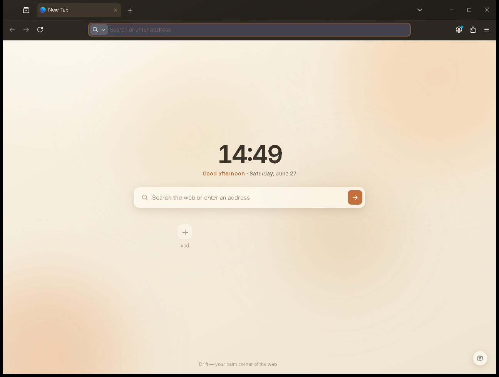

# Drift Browser

Drift is a custom Firefox-based browser built with [surfer](https://github.com/zen-browser/surfer), based on **Firefox 152.0.2**.

It ships a fully custom UI: cream/terracotta palette, Inter and Fraunces typography, 7 themes × 12 accent colours, minimal chrome (no bookmarks bar by default), and a redesigned new-tab page with clock, search, and dock widgets — no AI content.

## Screenshots

| | |
|---|---|
|  |  |
| *New Tab — clock, search, dock widgets (cream theme)* | *Browsing — minimal chrome, warm palette* |

## Platform

**Windows 64-bit** (x86_64)

## Downloads

Installer and portable ZIP are available under [Releases](../../releases).

| File | Description |
|------|-------------|
| `drift-1.0.0.en-US.win64.installer.exe` | Windows installer (~82 MB) |
| `drift-1.0.0.en-US.win64.zip` | Portable ZIP (~123 MB) |

## Installation

1. Download the installer from the [latest release](../../releases/latest).
2. Run the installer and follow the prompts.
3. Launch **Drift** from the Start Menu or desktop shortcut.

---

## Building / editing on a new machine

This repository contains the Drift project config files only. The multi-GB Firefox
source tree is **not included** — it is downloaded automatically by surfer.

### Prerequisites (Windows)

- [Node.js](https://nodejs.org/) 18+ and npm
- [Mozilla Build](https://ftp.mozilla.org/pub/mozilla/libraries/win32/MozillaBuildSetup-Latest.exe) (provides MSYS/make/autoconf in `C:\mozilla-build`)
- [Rust (stable, MSVC ABI)](https://rustup.rs/) — `rustup toolchain install stable-x86_64-pc-windows-msvc`
- [Visual Studio 2022](https://visualstudio.microsoft.com/) with the "Desktop development with C++" workload (MSVC + Windows SDK)
- Python 3.12

### Quick start

```bash
# 1. Clone this repo
git clone https://github.com/ArthurMoorgan/drift-browser.git
cd drift-browser

# 2. Install surfer
npm install

# 3. Download Firefox 152.0.2 source into engine/
npx surfer download

# 4. Import Drift branding and apply surfer overlays
#    This also copies everything under src/ into engine/
npx surfer import

# 5. Apply the engine patches (build fixes + UI modifications to existing Firefox files)
cd engine
git apply ../patches/drift-engine-changes.patch
cd ..

# 6. Build
bash do-build.sh

# 7. Package (produces installer + zip in engine/obj-x86_64-pc-windows-msvc/dist/)
bash do-package.sh
```

The first build takes 30–90 minutes depending on hardware. Subsequent incremental
builds are much faster.

### How the Drift UI is layered

The UI is split across two delivery mechanisms:

| Mechanism | What it carries |
|-----------|----------------|
| `src/` (surfer overlay) | **New files** that don't exist in vanilla Firefox — `drift-theme.css`, `drift-theme-chrome.js` (the theme engine), `drift-newtab.js`, Inter/Fraunces fonts (`.woff2`). `npx surfer import` copies them verbatim into `engine/`. |
| `patches/drift-engine-changes.patch` | **Modifications to existing Firefox files** — `browser-shared.css` (imports drift-theme.css), `jar.inc.mn` (registers new CSS + fonts), `addon-jar.mn` (registers newtab JS), `browser.xhtml` + `base/jar.mn` (load + register the theme engine), `firefox.js` (`drift.*` theme prefs, sidebar.revamp, startup prefs), `activity-stream.html` (full newtab replacement), plus all Windows build-fix patches. |

### Chrome theme engine (`drift-theme-chrome.js`)

The browser chrome is no longer a single static cream skin — it is a **runtime theme system** driven by `drift.*` prefs:

- **7 themes**: `light` · `sepia` · `arctic` · `dark` · `midnight` · `slate` · `noir` (pref `drift.theme`)
- **14 accent presets** with light/dark variants, or a custom hex (`drift.accent` / `drift.accentMode` / `drift.accentCustom`)
- **Live glass translucency + frost blur** (`drift.glass` 20–95, `drift.blur` px)
- **Modes**: `normal` · `lite` (opaque, no animation) · `minimal` (`drift.mode`)
- **Layout flags**: vertical tabs (`drift.vtabs`, mirrors into native `sidebar.verticalTabs`), compact, centered URL, acrylic

`drift-theme-chrome.js` is loaded by `browser.xhtml`, reads these prefs, and applies a `drift-theme` / `drift-mode` attribute plus inline CSS custom properties to the chrome root, re-applying live on any pref change. `drift-theme.css` then reacts via `:root[drift-theme="…"]` palette blocks. Native popups, menus, the downloads/library panels and the urlbar results are themed through the same palette so the whole UI follows the active theme.

### Ad blocking (uBlock Origin, built in)

Drift bundles **uBlock Origin** so ad/tracker blocking works out of the box — no install step. The AMO-signed xpi ships under `distribution/extensions/` and Firefox auto-installs it on first run. It is wired via `src/browser/extensions/ublock-origin/moz.build`, which uses `FINAL_TARGET_FILES.distribution.extensions` with `DIST_SUBDIR = ""` so the xpi lands at the app root's `distribution/` (not under `browser/`). Because the extension is AMO-signed, signature verification stays **enabled**. The patch also adds an unconditional `@RESPATH@/distribution/extensions/*` line to `package-manifest.in` (Firefox's stock `distribution/*` line is gated to official Mozilla builds).

### `src/` layout (mirrors `engine/` tree)

```
src/
  browser/
    base/content/
      drift-theme-chrome.js    ← theme engine: drift.* prefs → drift-theme attr + CSS vars (live)
    themes/shared/
      drift-theme.css          ← 7 theme palettes, accents, glass, lite/minimal, native-panel theming
    extensions/ublock-origin/
      moz.build                ← bundles uBlock Origin into distribution/extensions (DIST_SUBDIR="")
      uBlock0@raymondhill.net.xpi  ← AMO-signed uBlock Origin 1.71.0
    extensions/newtab/
      data/content/
        drift-newtab.js        ← theme init, clock, search, dock, widgets, settings panel
      prerendered/fonts/
        inter.woff2            ← Inter variable font (newtab local copy)
        fraunces.woff2         ← Fraunces variable font (newtab local copy)
    fonts/drift/
      inter.woff2              ← Inter font served as chrome://browser/skin/fonts/drift/inter.woff2
      fraunces.woff2           ← Fraunces font served as chrome://browser/skin/fonts/drift/fraunces.woff2
```

### Project layout

```
surfer.json          # Drift identity, version, brand colours, addons
package.json         # npm deps (surfer)
configs/             # Per-platform mozconfig overrides
  common/mozconfig
  windows/mozconfig  # MSVC target, enables js-shell / rust-simd / crashreporter
  linux/mozconfig
  macos/mozconfig
locales/             # Supported locale list
patches/             # Unified-diff patches applied to the Firefox source after download
  drift-engine-changes.patch
src/                 # surfer source overlay — files here mirror engine/ tree and are
                     # copied into engine/ during `npx surfer import`
do-build.sh          # Convenience wrapper: sets PATH/env then runs mach build (Windows/MSYS)
do-configure.sh      # Same for mach configure
do-package.sh        # Runs mach package to produce installer + zip
```

### What the patch covers (`patches/drift-engine-changes.patch`)

The patch is applied with `git apply` (or `patch -p1`) from inside `engine/` after
`npx surfer import`. It contains:

| File | Change |
|------|--------|
| `browser/config/version.txt` | Version string → `1.0.0` |
| `browser/config/version_display.txt` | Display version → `1.0.0` |
| `browser/moz.configure` | Vendor → `Drift`, profile dir → `drift` |
| `build/moz.configure/toolchain.configure` | Clang MinGW triple fix (Windows builds) |
| `build/moz.configure/windows-toolchain.configure` | MSVC / MinGW header path selection |
| `dom/crypto/CryptoBuffer.h` | Use `BufferSourceBinding.h` (forward-decl was insufficient) |
| `python/mozbuild/mozbuild/backend/recursivemake.py` | **Windows MAX_PATH fix** — skip per-object `.obj` prerequisites on `os.name == "nt"` |
| `python/mozbuild/mozbuild/jar.py` | **Windows MAX_PATH fix** — `os.path.abspath(basepath)` in `OutputHelper_flat.__init__` |
| `browser/themes/shared/browser-shared.css` | Imports `drift-theme.css` after all other imports |
| `browser/themes/shared/jar.inc.mn` | Registers `drift-theme.css` and `fonts/drift/*.woff2` in chrome |
| `browser/extensions/newtab/addon-jar.mn` | Registers `drift-newtab.js` as a content resource |
| `browser/extensions/newtab/prerendered/activity-stream.html` | Full newtab replacement (cream palette, clock, search, dock, settings) |
| `browser/app/profile/firefox.js` | Startup prefs: hide bookmarks bar, close sidebar, disable newtab telemetry |

### Drift UI features (Layer 1)

- **7 themes**: Cream, Terracotta, Forest, Ocean, Midnight, Rose, Slate
- **12 accent colours**: selectable per-theme
- **Typography**: Inter (UI) and Fraunces (display/headings)
- **Minimal chrome**: bookmarks bar hidden by default; sidebar closed at startup
- **New-tab page**: clock, date, search bar, app dock, widget grid — no AI, no Pocket, no recommendations
- **Settings panel**: theme picker, accent picker, font size controls — stored in localStorage

### Windows MAX_PATH notes

Firefox's build system generates make rules with relative `.obj` file paths. On
Windows, GNU make resolves these as `CWD + relative_path`, which can exceed
MAX_PATH (260 chars) causing spurious "No rule to make target" / `ENOENT` errors.
Two fixes are in the patch above; if for any reason you need to re-apply them
manually:

**`python/mozbuild/mozbuild/jar.py` (~line 552):**
```diff
-            self.basepath = basepath
+            self.basepath = os.path.abspath(basepath)
```

**`python/mozbuild/mozbuild/backend/recursivemake.py` (~lines 1492 and 1523):**  
Wrap both occurrences of
```python
backend_file.write("%s: %s\n" % (obj_target, objs_ref))
```
inside `_process_linked_libraries` with `if os.name != "nt":`.

If `mach configure` is re-run it regenerates `backend.mk` — the recursivemake.py
fix prevents the long-path prereqs from being written in the first place, so no
manual post-configure edit is needed.

### WebIDL codegen note (re-apply if needed)

If you build with `--disable-tests` in `configs/windows/mozconfig`, the WebIDL
codegen may produce an incomplete `OwningUnrestrictedDoubleOrString` type in
`obj-*/dist/include/mozilla/dom/AnimationEffectBinding.h`. Workaround: run
`mach build` and if the style crate fails with an incomplete-type error, add a
full `OwningUnrestrictedDoubleOrString` class definition (modelled on
`OwningNodeOrString` from `UnionTypes.h`) to that generated header.

---

## About

Drift is a custom-branded Firefox 152.0.2 build targeting Windows x86_64. The
Drift UI is designed for focus and calm productivity — no noise, no tracking,
no AI integration.
